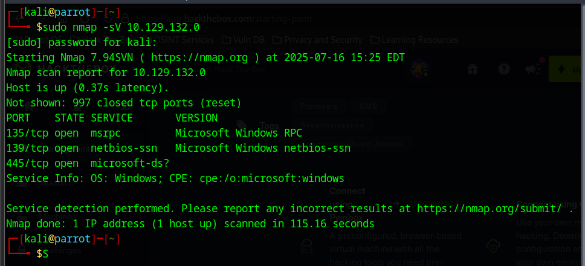
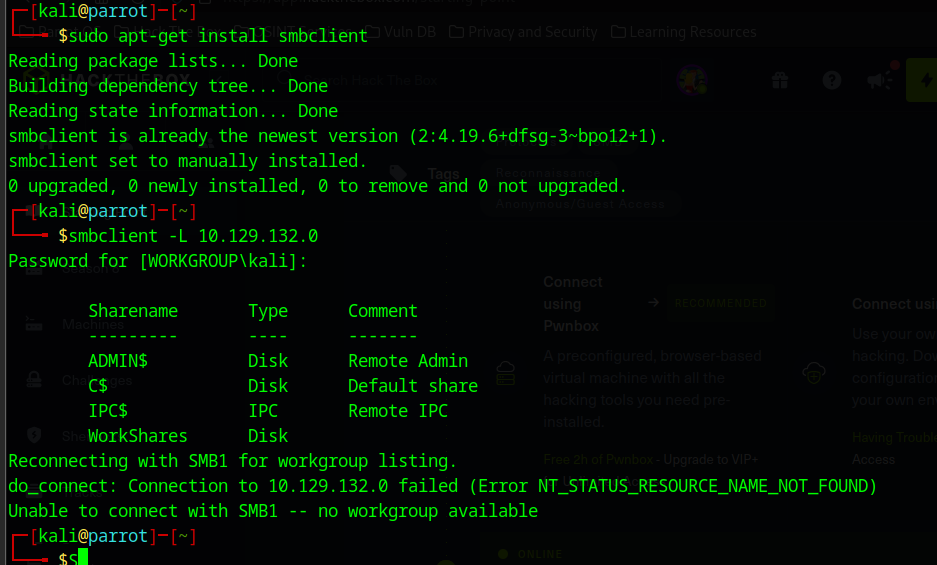
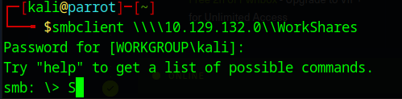
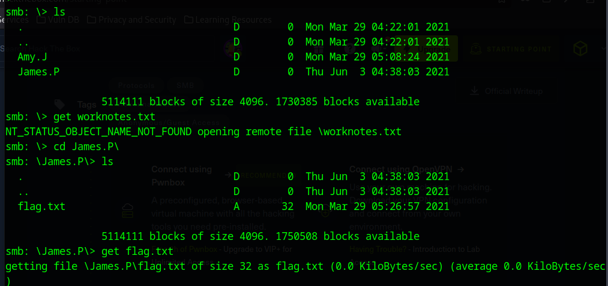
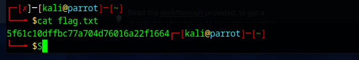

# Enumerating SMB for vulnerabilities
The SMB protocol allows applications or users to access, create, and modify files and other resources like printers on a remote server. It also enables communication with server programs designed to handle SMB requests.

Given SMB's capabilities for file creation, editing, retrieval, and deletion on a share, robust authentication is essential. Typically, SMB clients must provide a username and password to interact with shared content. However, network administrators can inadvertently misconfigure shares, allowing access without valid credentials, or via guest or anonymous logins.

1. Using NMAP to scan the target

With TCP port 445 for SMB active, an accessible network share is available for exploration. This share functions like a remote folder. To access its contents, we'll need specific services and scripts, such as smbclient, to enumerate its content on the remote system."

2. Install SMB client and try to log in.

Attempting to log in to the custom WorkShares SMB share:

The login is successful

3. Getting the flag:

The lab is successful and the flag is captured!